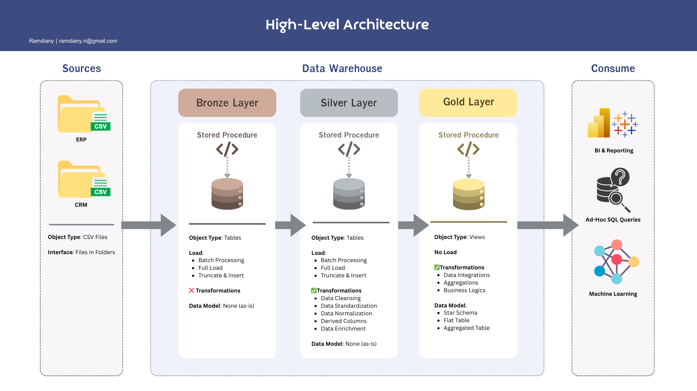

# Data Warehouse & Analytics Portfolio Project

Welcome to the **Data Warehouse & Analytics Portfolio Project** repository.  
This project presents an end-to-end implementation of a modern data warehouse, covering ingestion, transformation, modeling, and analytical querying. It is built as a professional portfolio project to demonstrate practical data engineering and analytics capabilities aligned with industry standards.

---

## 🏗️ Data Architecture

The solution is designed using the **Medallion Architecture**, consisting of **Bronze**, **Silver**, and **Gold** layers:



### Architecture Layers
1. **Bronze Layer**: Stores raw data as-is from the source systems. Data is ingested from CSV Files into SQL Server Database.
2. **Silver Layer**: This layer includes data cleansing, standardization, and normalization processes to prepare data for analysis.
3. **Gold Layer**: Houses business-ready data modeled into a star schema required for reporting and analytics.

---

## 📖 Project Overview

This project involves:

1. **Data Architecture**: Designing a Modern Data Warehouse Using Medallion Architecture **Bronze**, **Silver**, and **Gold** layers.
2. **ETL Pipelines**: Extracting, transforming, and loading data from source systems into the warehouse.
3. **Data Modeling**: Developing fact and dimension tables optimized for analytical queries.
4. **Analytics & Reporting**: Creating SQL-based reports and dashboards for actionable insights.

### Skills Demonstrated

- SQL Development  
- Data Engineering  
- Data Architecture  
- ETL Pipeline Design  
- Dimensional Modeling  
- Data Analytics  

---

## 🛠️ Tools & Resources

All tools used in this project are freely available:

- **Datasets (`datasets/`)**  
  CSV files representing ERP and CRM source systems.

- **SQL Server Express**  
  Lightweight SQL Server instance for local data warehousing.

- **SQL Server Management Studio (SSMS)**  
  Database management and query interface.

- **Git & GitHub**  
  Version control and repository management.

- **Draw.io & Canva**  
  Architecture diagrams, data models, and data flow visualisations.

- **Notion**  
  Project planning, task tracking, and documentation support.

---

## 🚀 Project Requirements

### Data Warehouse Implementation (Data Engineering)

#### Objective
Build a SQL Server-based data warehouse to consolidate sales-related data and enable analytical reporting.

#### Specifications
- **Source Systems**: ERP and CRM data provided as CSV files  
- **Data Quality**: Apply cleansing and validation before analytics consumption  
- **Integration**: Merge multiple sources into a unified analytical data model  
- **Scope**: Focus on current-state data only (no historical tracking)  
- **Documentation**: Provide clear and structured documentation of models and design decisions  

---

### BI & Analytics (Data Analysis)

#### Objective
Develop analytical SQL queries to generate insights related to:
- Customer behaviour  
- Product performance  
- Sales trends  

These outputs are designed to support business-level decision-making through clear and reliable metrics.

Additional details can be found in `docs/requirements.md`.

---

## 📂 Repository Structure
```
data-warehouse-project/
│
├── datasets/                           # Raw datasets used for the project (ERP and CRM data)
│
├── docs/                               # Project documentation and architecture details
│   ├── etl.drawio                      # Draw.io file shows all different techniquies and methods of ETL
│   ├── data_architecture.drawio        # Draw.io file shows the project's architecture
│   ├── data_catalog.md                 # Catalog of datasets, including field descriptions and metadata
│   ├── data_flow.drawio                # Draw.io file for the data flow diagram
│   ├── data_models.drawio              # Draw.io file for data models (star schema)
│   ├── naming-conventions.md           # Consistent naming guidelines for tables, columns, and files
│
├── scripts/                            # SQL scripts for ETL and transformations
│   ├── bronze/                         # Scripts for extracting and loading raw data
│   ├── silver/                         # Scripts for cleaning and transforming data
│   ├── gold/                           # Scripts for creating analytical models
│
├── tests/                              # Test scripts and quality files
│
├── README.md                           # Project overview and instructions
├── LICENSE                             # License information for the repository
├── .gitignore                          # Files and directories to be ignored by Git
└── requirements.txt                    # Dependencies and requirements for the project
```
---
## 🌟 About Me

Hi there! I'm **Novia Noer Ramdiany**. I’m passionate on data fields.

Let's stay in touch! Feel free to connect with me on LinkedIn: https://www.linkedin.com/in/noviaramdiany/

